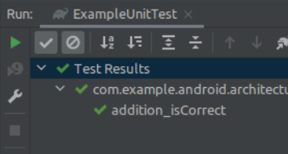
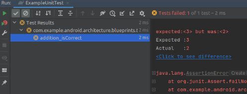
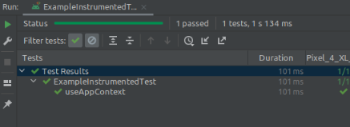
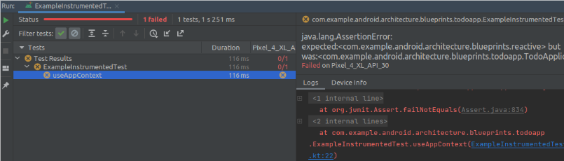

# Android Studio eos testes
O funcionamento dos teste no Android Studio

## Conjuntos de origem 
O Android Studio agrupa o código-fonte e os recursos de maneira lógica para cada módulo, criando conjuntos de origem.

- **main:** contém o código do seu aplicativo. Esse código é compartilhado entre todas as diferentes versões do aplicativo que você pode criar (conhecidas como variantes de compilação).
- **androidTest:** Contém testes conhecidos como testes instrumentados.
- **test:** Contém testes conhecidos como testes locais.

A diferença entre testes locais e testes instrumentados está na forma como são executados.

## Android Junit (test)
Esses testes são executados localmente na JVM de sua máquina de desenvolvimento e não requerem um emulador ou dispositivo físico. Por causa disso, eles correm rápido, mas sua fidelidade é menor, o que significa que eles agem menos como fariam no mundo real.
No Android Studio, os testes locais são representados por um ícone de triângulo verde e vermelho.

### Maneiras de executar testes
O diagrama abaixo mostra algumas outras maneiras de executar testes no Android Studio. Cada um é explicado no link abaixo.

### Saída no Run
As marcas de seleção verdes expandem os resultados do teste para confirmar que um teste chamado “addition_isCorrect” foi aprovado ou não.

> Foi aprovado

> Uma única asserção com falha, falha em todo o teste e você é direcionado para a linha da asserção com falha.

## Android Instrumented Tests (androidTest)
Esses testes são executados em dispositivos Android reais ou emulados, de modo que refletem o que acontecerá no mundo real, mas também são muito mais lentos.
No Android Studio, os testes instrumentados são representados por um Android com um ícone de triângulo verde e vermelho.

### Maneiras de executar testes
Ao contrário do teste local, este teste é executado em um dispositivo. Cada um é explicado no link abaixo.

### Saída no Run

> Foi aprovado

> Uma única asserção com falha, falha em todo o teste e você é direcionado para a linha da asserção com falha.

## Gerar stubs de teste
O Android Studio oferece ferramentas para gerar stubs de teste para ajudá-lo a implementar os testes para essa função.
<video>

[1]: https://developer.android.com/codelabs/advanced-android-kotlin-training-testing-basics#4
[2]: https://developer.android.com/studio/test/command-line

[3]: https://developer.android.com/codelabs/advanced-android-kotlin-training-testing-basics#4
[4]: https://developer.android.com/studio/test/command-line
