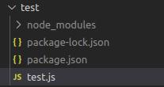

# Regras de segurança de teste de unidade com o Firebase

As regras de segurança do Firebase protegem seus dados contra usuários mal-intencionados. Elas definem quem vai poder escrever, ler, editar e excluir algo.  
O emulador do firebase simula as ferramentas do firebase para que o desenvolver possa fazer testes sem interferir no banco em produção.  
Os testes ajuda a garantir a segurança da aplicação, encontrar falhas e otimizar as regras. Eles usam o emulador pois não corre o risco de quebrar o banco em produção e os teste são feitos mais rapidos já que localmente não dependem da conexão.

Os teste de segurança geralmente tem a mentalidade de simular dois tipos de situação: 
- Um usuário normal com suas credencias tentando fazer requisiçoes.
- Um hacker/usuario sem permição tenatndo fazer requisições.

Com essa mentalidade, podemos fazer varios teste de diversos cenarios para que o banco fique cada vez mais seguro.

## Ferramentas e Requisitos
**IDE:** Aconcelhavel usar o VSCode com a extenção Firebase (Firestore Security Rules syntax highlighting).  
**Emulador:** O emulador do firebase precisa ser configurado - [Configure os emuladores do Firebase][2].  
**Node e npm:**   
**Java:** de preferencia a mais recente  
**Firebase CLI** versões atualizadas do CLI. A versaõ mais resente pode ser pega com: `npm -i g firebase-tools`  
**Projeto do Firebase** com regra de segurança.  

## Primeiros passos
- Inicializar o Firebase `firebase init`
- Criar um diretorio na raiz chamado test, onde vão estar os arquivos em js

Digitar na pasta test:
- Dentro da pasta test, digitar `npm init` para configurar as coisas.
- Manter a maioria dos padrões (exeto em casos muitos especificos), os que precisão ser configurados são:
  -   description: com a descrição do test
  -   nome do arquivo (test.js)
  -   test-command `mocha --exit` - [Mocha][3]
- Em seguida deve se intalar algumas bibliotecas:
  -  `npm install mocha --save-dev` para chamar o macha
  -  `npm install @firebase/testing` --save-dev para facilitar o teste com o firebase
Terminando isso as configurações iniciais estão prontas, agora é só abrir o VSCode.

> Observações: Essas configurações devem ser seguidas toda vez que um projeto novo está na sua máquina. Mesmo que o aquivo teste.js já esteja criado você deve seguir os passos para instalar os pacotes de confiruraçao, que não deve ser subidos para o git.

## Run teste
- Inicializar o Emulador `firebase emulators:start`

Digitar na pasta test:
- Rodar o teste `npm test`

## Mocha
Basicamente um framework JavaScripit que torna a escrita de um teste unitário muito mais fácil.
O modelo mocha é o que podemos chamar de estilo de teste orientado a comportamento, no qual você geralmente descreve todas as coisas que seu aplicativo deve fazer e os testes corretos que fazem asserções em torno de cada descrição. 

<!-- Parei em 7:57 do vìdeo https://www.youtube.com/watch?v=VDulvfBpzZE&t=2s   -->

[1]: https://firebase.google.com/docs/rules/unit-tests
[2]: https://firebase.google.com/docs/rules/emulator-setup
[3]: https://github.com/RafaelaBF/Testes_no_Android/new/main/Anota%C3%A7%C3%B5es#mocha
