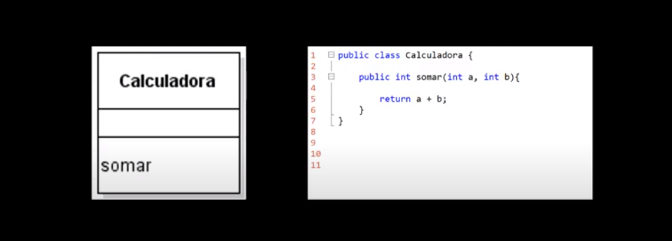
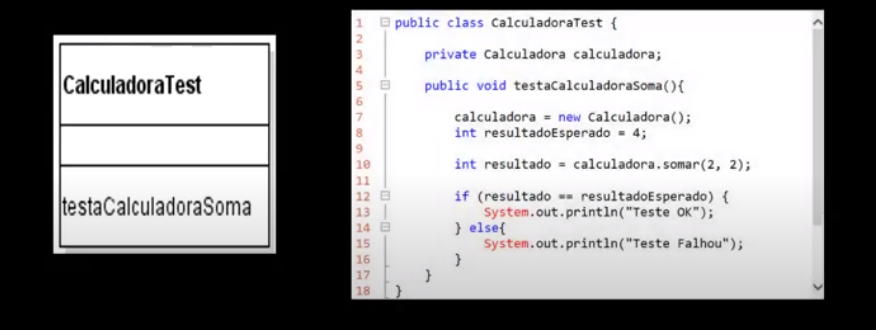

# Testes Conceitos
**Conceito:** O teste em si, contata se algo funciona corretamente, de acordo com que é esperado. 

## Tipos de teste
- **Funcional:** É quando a aplicação inteira, ou pate significativa, é entre ao cliente para testar.
- **Smoke Test:** É o teste que o desenvolverdor faz antes de entregar a aplicação para teste ao cliente.
- **Integração:** É um teste que foca nos componentes estão interagindo entre si. Verifica se as partes estão funcionando entre si.
- **Segurança:** Vai verificar se a aplicação é segura ou está sujeita a ataque.
- **Carga:** Checar o comportamento do software quando há muitos usuários.
- **Unitário:** É um teste feito pelo dessenvolverdor, ele foca exclusivamente ao método de uma class.

### Teste Unitário
**Conceito:** É um trecho de código, que executa outro trecho de código e verifica se executou corretamente.

   

